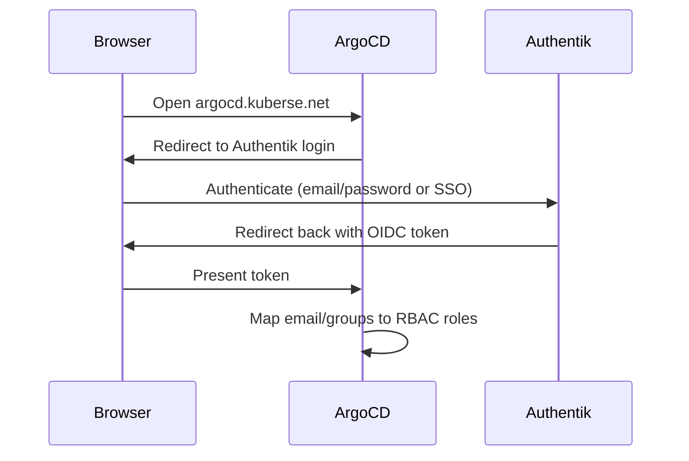

# ArgoCD Configuration

> Ingress, SSO (OIDC via Authentik), and RBAC configuration for the ArgoCD deployment.

| Property | Value |
|----------|-------|
| **Chart** | `platform/charts/argocd-config/` |
| **Sync Wave** | 1 |
| **Namespace** | `argocd` |
| **Dependencies** | ArgoCD (installed during bootstrap), Vault (Wave 1), Authentik (Wave 1), Ingress NGINX (Wave 1) |
| **URL** | `https://argocd.kuberse.net` |

## Overview

This chart does **not** install ArgoCD -- ArgoCD is installed separately during the platform bootstrap (`kuberse init`). Instead, this chart configures the existing ArgoCD instance with:

- **Ingress** -- exposes ArgoCD at `argocd.kuberse.net` via NGINX
- **OIDC SSO** -- integrates with Authentik so users log in via the platform identity provider
- **RBAC** -- defines who gets admin vs read-only access

## How SSO Works

ArgoCD authenticates users through Authentik using the OIDC protocol:



**You don't need to configure this manually.** The OIDC credentials (`clientID`, `clientSecret`) are automatically provisioned by the [Authentik OIDC Provisioner](../authentik/docs/oidc-provisioning.md) and written to Vault at `secret/argocd/oidc`. The VSO syncs them into a Kubernetes Secret that ArgoCD reads.

### How OIDC credentials get to ArgoCD

1. This chart creates a ConfigMap labeled `kuberse.net/authentik-oidc: "true"` declaring ArgoCD's OIDC requirements (redirect URI, scopes, etc.)
2. The Authentik OIDC Provisioner Job discovers this ConfigMap
3. The Job creates an OAuth2 provider in Authentik and writes `clientID`/`clientSecret` to `secret/argocd/oidc` in Vault
4. The VSO syncs the Vault secret to a Kubernetes Secret in the `argocd` namespace
5. ArgoCD reads the Secret and uses it for OIDC authentication

## RBAC

Access is controlled through ArgoCD's built-in RBAC system:

| Role | Who | Permissions |
|------|-----|-------------|
| `role:admin` | Users matching `${ADMIN_EMAIL}` or in the `admin` group | Full access: applications, clusters, repos, accounts, exec, logs |
| `role:readonly` | Everyone else (default policy) | Read-only access to all resources |

The admin email is set during platform bootstrap (stored in `kuberse-config` Secret). Group membership comes from the `groups` claim in the OIDC JWT token, which Authentik populates based on user assignments.

## Configuration

| Setting | Default | Description |
|---------|---------|-------------|
| `ingress.host` | `argocd.kuberse.net` | External hostname |
| `oidc.enabled` | `true` | Enable OIDC SSO |
| `oidc.issuer` | `https://auth.kuberse.net/application/o/argocd/` | Authentik OIDC issuer URL |
| `oidc.scopes` | `[openid, profile, email, groups]` | OIDC scopes requested |
| `rbac.defaultPolicy` | `role:readonly` | Default role for authenticated users |
| `vault.secretPath` | `argocd/oidc` | Vault path for OIDC credentials |

## Resources Created

| Resource | Name | Description |
|----------|------|-------------|
| ConfigMap | `argocd-cm` | ArgoCD server config (OIDC settings, URL) |
| ConfigMap | `argocd-rbac-cm` | RBAC policy and scopes |
| ConfigMap | `argocd-authentik-oidc` | Labeled for OIDC provisioner discovery |
| Ingress | `argocd` | Routes `argocd.kuberse.net` to `argocd-server:443` (HTTPS backend) |
| VaultStaticSecret | `argocd-oidc-vault` | Syncs `secret/argocd/oidc` to K8s Secret |
| ConfigMap | `argocd-config-vault-role` | Labeled `vault: setup-creds` for Vault CronJob |

## Vault Integration

| Resource | Vault Path | Keys |
|----------|-----------|------|
| VaultStaticSecret | `secret/argocd/oidc` | `clientID`, `clientSecret` (auto-written by OIDC provisioner) |

You do **not** need to manually store OIDC secrets in Vault -- the Authentik provisioner handles this automatically.

## Initial Admin Access

During bootstrap, before OIDC is configured, ArgoCD is accessible with the admin password:

```bash
# Get the initial admin password
kubectl -n argocd get secret argocd-initial-admin-secret -o jsonpath='{.data.password}' | base64 -d
```

Once OIDC is active, use "Log in via Authentik" in the ArgoCD UI.

## Debugging

```bash
# Check ArgoCD pods
kubectl get pods -n argocd

# View ArgoCD server logs (OIDC errors appear here)
kubectl logs -f deploy/argocd-server -n argocd

# Check OIDC configuration
kubectl get cm argocd-cm -n argocd -o yaml | grep -A 20 oidc

# Check RBAC policy
kubectl get cm argocd-rbac-cm -n argocd -o yaml

# Verify OIDC secret exists
kubectl get secret argocd-oidc-secrets -n argocd

# Test OIDC discovery endpoint
kubectl exec -it deploy/argocd-server -n argocd -- \
  curl -s https://auth.kuberse.net/application/o/argocd/.well-known/openid-configuration | head -5
```

## Common Issues

| Symptom | Cause | Fix |
|---------|-------|-----|
| "Log in via Authentik" button missing | OIDC not configured in `argocd-cm` | Check `kubectl get cm argocd-cm -n argocd -o yaml` for `oidc.config` |
| OIDC login fails with "connection refused" | DNS hairpin not configured for `auth.kuberse.net` | Check CoreDNS: `kubectl get cm coredns -n kube-system -o yaml` |
| "Unauthorized" after OIDC login | User email not in RBAC policy | Add user to `admin` group in Authentik or update `rbac.policy` |
| Ingress returns 502 | ArgoCD server not ready | Check `kubectl get pods -n argocd` |
