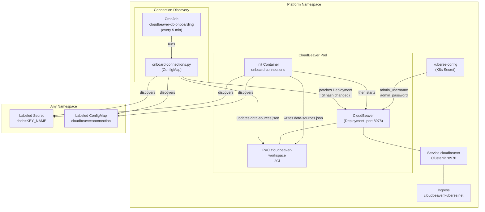
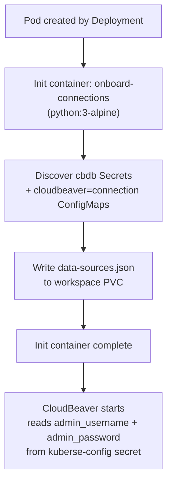

# CloudBeaver

> Web-based database management tool with automatic connection discovery from Kubernetes Secrets and ConfigMaps.

| Property | Value |
|----------|-------|
| **Chart** | `platform/charts/cloudbeaver/` |
| **Sync Wave** | 1 |
| **Namespace** | `platform` |
| **App Version** | 25.2.5 |
| **Dependencies** | Namespaces (Wave -1), PostgreSQL (Wave 1) |
| **URL** | `https://cloudbeaver.kuberse.net` |

## Overview

This chart deploys CloudBeaver Community Edition in the `platform` namespace, providing a browser-based database management UI at `cloudbeaver.kuberse.net`.

The key feature is **automatic connection discovery** -- services do not need to configure connections manually in CloudBeaver. Instead, they create a labeled Kubernetes resource (Secret or ConfigMap), and a CronJob discovers it and registers the connection automatically in CloudBeaver's `data-sources.json`.

There are two discovery sources (dual-source):

1. **Secrets labeled `cbdb=<key>`** (preferred) -- full `postgresql://` connection string with credentials. CloudBeaver connects without prompting for a password.
2. **ConfigMaps labeled `cloudbeaver=connection`** (legacy) -- individual field keys (`name`, `host`, `port`, `database`, `username`, `driver`, `provider`). No password stored -- CloudBeaver prompts the user at connection time.

Both sources are merged. If a Secret and a ConfigMap would produce the same connection ID, the Secret takes precedence.

Admin credentials (`CB_ADMIN_NAME`, `CB_ADMIN_PASSWORD`) are read from the shared `kuberse-config` Kubernetes Secret (keys `admin_username`, `admin_password`).

## Architecture



## Resources Created

| Resource | Name | Description |
|----------|------|-------------|
| Deployment | `cloudbeaver` | CloudBeaver pod with 1 init container |
| Service | `cloudbeaver` | ClusterIP on port 8978 |
| PersistentVolumeClaim | `cloudbeaver-workspace` | 2Gi storage for CloudBeaver workspace |
| Ingress | `cloudbeaver` | Routes `cloudbeaver.kuberse.net` to port 8978 |
| ServiceAccount | `cloudbeaver-sa` | Single SA for all CloudBeaver resources |
| ConfigMap | `cloudbeaver-onboarding-script` | Embeds `onboard-connections.py` |
| CronJob | `cloudbeaver-db-onboarding` | Runs the discovery script every 5 minutes |
| ClusterRole | `cloudbeaver-db-onboarding` | Read secrets, configmaps, and namespaces across the cluster |
| ClusterRoleBinding | `cloudbeaver-db-onboarding` | Binds `cloudbeaver-sa` to ClusterRole |
| Role | `cloudbeaver-db-onboarding` | Patch the CloudBeaver Deployment (restart trigger) |
| RoleBinding | `cloudbeaver-db-onboarding` | Binds `cloudbeaver-sa` to the Deployment-patch Role |

## Startup Sequence

The CloudBeaver pod has one init container that runs before the main container starts:



1. **onboard-connections** -- runs `onboard-connections.py` to discover all labeled Secrets and ConfigMaps, builds `data-sources.json`, and writes it to the workspace PVC. This ensures connections are pre-configured on first boot.
2. **cloudbeaver** -- starts with `CB_ADMIN_NAME` and `CB_ADMIN_PASSWORD` from the `kuberse-config` Secret.

## Admin Credentials

CloudBeaver reads admin credentials from the shared `kuberse-config` Kubernetes Secret:

| Secret Key | Environment Variable | Description |
|------------|---------------------|-------------|
| `admin_username` | `CB_ADMIN_NAME` | Admin user (must NOT be `"admin"` -- see note below) |
| `admin_password` | `CB_ADMIN_PASSWORD` | Admin password |

> **Important:** The admin name must NOT be `"admin"` -- CloudBeaver 25.2.5 creates a default team named `admin` in `CB_AUTH_SUBJECT`, and using the same name for the admin user causes a "User or team 'admin' already exists" error.

## Configuration

| Setting | Default | Description |
|---------|---------|-------------|
| `image.tag` | `25.2.5` | CloudBeaver version |
| `deployment.replicas` | `1` | Deployment replicas |
| `updateStrategy.type` | `Recreate` | Update strategy (Recreate for PVC access) |
| `service.port` | `8978` | Service port |
| `persistence.size` | `2Gi` | PVC size |
| `ingress.host` | `cloudbeaver.kuberse.net` | Public hostname |
| `admin.credSecretName` | `kuberse-config` | Secret containing admin credentials |
| `dbOnboarding.cronSchedule` | `*/5 * * * *` | CronJob schedule |
| `dbOnboarding.namespaceToSearch` | `null` | Namespace filter (`null` = all, `[]` = disabled, `[list]` = specific) |

## Vault Integration

**None.** CloudBeaver previously had dedicated Vault integration, but it has been removed. Admin credentials now come from the shared `kuberse-config` Secret, which is managed separately.

## Debugging

```bash
# Pod status
kubectl get pods -n platform -l app.kubernetes.io/name=cloudbeaver

# Pod logs
kubectl logs -f deploy/cloudbeaver -n platform

# Init container logs (if pod is stuck in Init)
kubectl logs deploy/cloudbeaver -n platform -c onboard-connections

# CronJob status
kubectl get cronjob cloudbeaver-db-onboarding -n platform

# Trigger a manual onboarding run
kubectl create job --from=cronjob/cloudbeaver-db-onboarding manual-onboard -n platform

# Inspect data-sources.json
kubectl exec -it deploy/cloudbeaver -n platform -- \
  cat /opt/cloudbeaver/workspace/GlobalConfiguration/.dbeaver/data-sources.json

# Find all cbdb-labeled Secrets
kubectl get secrets --all-namespaces -l cbdb

# Find all cloudbeaver=connection ConfigMaps
kubectl get configmaps --all-namespaces -l cloudbeaver=connection

# Check RBAC
kubectl auth can-i list secrets --as=system:serviceaccount:platform:cloudbeaver-sa --all-namespaces
```

### Common Issues

| Symptom | Likely Cause | Fix |
|---------|-------------|-----|
| Pod stuck in `Init:0/1` | `onboard-connections` init container failing | Check logs: `kubectl logs deploy/cloudbeaver -n platform -c onboard-connections` |
| CronJob 403 Forbidden | RBAC misconfigured | Verify ClusterRoleBinding: `kubectl get clusterrolebinding cloudbeaver-db-onboarding -o yaml` |
| Connections not appearing | No labeled resources found | Check labels: `kubectl get secrets -A -l cbdb` and `kubectl get cm -A -l cloudbeaver=connection` |
| "User or team 'admin' already exists" | Admin name set to `admin` | Change the `admin_username` value in `kuberse-config` to something else (e.g. `cbadmin`) |
| Connections visible but no auto-restart | Hash unchanged | Check annotation: `kubectl get deploy cloudbeaver -n platform -o jsonpath='{.spec.template.metadata.annotations}'` |
