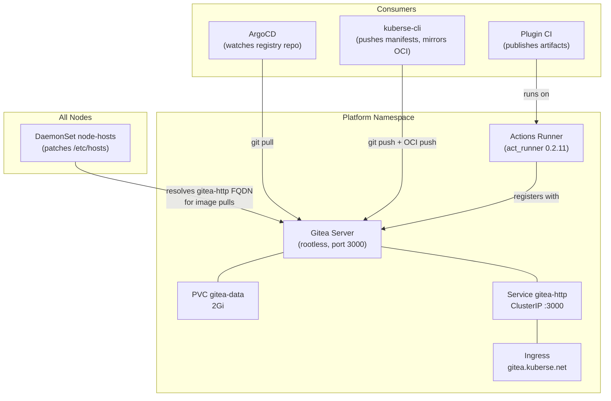

# Gitea

> Self-hosted Git service with Actions runner and OCI container registry.

| Property | Value |
|----------|-------|
| **Chart** | `platform/charts/gitea/` |
| **Sync Wave** | 1 |
| **Namespace** | `platform` |
| **Image** | `gitea/gitea:1.23.7-rootless` |
| **Dependencies** | Namespaces (Wave -1), Vault (Wave 1, optional), Ingress NGINX (Wave 1) |
| **URL** | `https://gitea.kuberse.net` |

## Overview

Gitea is the platform's internal Git hosting service. It stores the **registry repo** (the GitOps source of truth that ArgoCD watches) and any plugin repos cloned via `kuberse plugin install <git-url>`. It also provides:

- **OCI Container Registry** -- stores mirrored Helm charts and container images for plugins and platform artifacts
- **Gitea Actions** -- CI/CD runner for building plugin artifacts when installed via git-mode

## Architecture



## Key Features

### OCI Container Registry

Gitea provides a built-in OCI-compatible container registry at the same host (`gitea-http.platform.svc.cluster.local:3000`). The CLI uses it to mirror:

- **Helm charts** from GHCR to `<gitea-host>/<org>/charts/<plugin-name>:<version>`
- **Container images** from GHCR to `<gitea-host>/<org>/<image-name>:<tag>`

ArgoCD Applications then pull charts from this internal registry. The `${REGISTRY_URL}` placeholder in plugin manifests resolves to Gitea's address.

### Gitea Actions Runner

An `act_runner` pod is deployed alongside Gitea. It registers with the Gitea instance and executes CI workflows when plugin repos are pushed via git-mode install. The runner uses Docker-in-Docker to build container images.

### Node Hosts DaemonSet

A DaemonSet patches `/etc/hosts` on every node to resolve `gitea-http.platform.svc.cluster.local` to the Gitea ClusterIP. This is needed because container runtimes (containerd/cri-o) on the node itself need to pull images from the Gitea registry during pod creation, but they don't use cluster DNS.

## Configuration

| Setting | Default | Description |
|---------|---------|-------------|
| `image.tag` | `1.23.7-rootless` | Gitea version |
| `ingress.host` | `gitea.kuberse.net` | External hostname |
| `persistence.size` | `2Gi` | Data volume size |
| `config.actions.enabled` | `true` | Enable Gitea Actions |
| `runner.enabled` | `true` | Deploy the Actions runner |
| `nodeHosts.enabled` | `true` | Deploy the node /etc/hosts DaemonSet |
| `nodePort.enabled` | `false` | Temporary bootstrap NodePort access (port 30300) |
| `vault.enabled` | `false` | Vault integration (see "Bootstrap Phases" below) |
| `vault.secretPath` | `gitea/config` | Vault path for admin credentials |

## Secrets

### Bootstrap Phases

Gitea has a two-phase credential model:

1. **Phase 1 (bootstrap):** `vault.enabled: false`. Gitea reads admin credentials from environment variables set by the `kuberse init` process. This allows Gitea to start before Vault is operational.
2. **Phase 2 (post-bootstrap):** `vault.enabled: true`. Credentials come from Vault via VSO. The `kuberse setup` command toggles this automatically after Vault is initialized and secrets are seeded.

You don't need to manage this manually -- the CLI handles the transition.

### Required secrets in Vault (`secret/gitea/config`)

| Key | Description |
|-----|-------------|
| `admin_username` | Gitea admin username |
| `admin_password` | Gitea admin password |
| `admin_email` | Gitea admin email |

These are typically the same values as the shared `kuberse-config` Secret (set during `kuberse setup`).

### Storing credentials

```bash
kubectl exec -it vault-0 -n platform -- vault kv put \
  secret/gitea/config \
  admin_username=gitea_admin \
  admin_password=your-secure-password \
  admin_email=admin@example.com
```

## How the Platform Uses Gitea

### Registry Repo

The most important repo in Gitea is `<org>/kuberse` -- this is the registry repo that ArgoCD watches. When you run `kuberse plugin install`, the CLI:

1. Copies plugin manifests to `plugins/<name>/` in this repo
2. Resolves placeholders
3. Commits and pushes
4. ArgoCD picks up the changes and deploys

### Plugin Git-Mode Install

When you run `kuberse plugin install https://github.com/owner/plugin.git`:

1. The CLI mirrors the GitHub repo into Gitea
2. Rewrites workflow `uses:` references to point at the local Gitea org
3. Triggers the CI workflow via Gitea Actions
4. The runner builds and publishes OCI artifacts to Gitea's registry
5. You then install the plugin via its OCI reference

## Resources Created

| Resource | Name | Description |
|----------|------|-------------|
| Deployment | `gitea` | Gitea server (rootless, port 3000) |
| Deployment | `gitea-runner` | Actions runner (act_runner) |
| DaemonSet | `gitea-node-hosts` | Patches /etc/hosts on nodes |
| PVC | `gitea-data` | 2Gi persistent volume |
| Service | `gitea-http` | ClusterIP on port 3000 |
| Service | `gitea-nodeport` | NodePort on 30300 (when enabled) |
| Ingress | `gitea` | Routes `gitea.kuberse.net` |
| ConfigMap | `gitea-config` | Gitea `app.ini` settings |
| ServiceAccount | `gitea-sa` | For Vault auth (when enabled) |
| ConfigMap | `gitea-vault-role` | Labeled `vault: setup-creds` (when vault enabled) |

## Debugging

```bash
# Check Gitea pods
kubectl get pods -n platform -l app.kubernetes.io/name=gitea

# Gitea server logs
kubectl logs -f deploy/gitea -n platform

# Runner logs
kubectl logs -f deploy/gitea-runner -n platform

# Check if registry is accessible from inside cluster
kubectl exec -it deploy/kuberse-cli -n platform -- \
  curl -s http://gitea-http.platform.svc.cluster.local:3000/api/v1/repos/search | head

# List OCI packages
kubectl exec -it deploy/kuberse-cli -n platform -- \
  curl -s http://gitea-http.platform.svc.cluster.local:3000/api/v1/packages/<org>?type=container

# Check node-hosts DaemonSet
kubectl get ds gitea-node-hosts -n platform
kubectl get pods -n platform -l app=gitea-node-hosts

# Verify /etc/hosts on a node
kubectl debug node/<node-name> -it --image=busybox -- cat /etc/hosts | grep gitea
```

## Common Issues

| Symptom | Cause | Fix |
|---------|-------|-----|
| `ErrImagePull` from Gitea registry | Node can't resolve `gitea-http.platform.svc.cluster.local` | Check DaemonSet: `kubectl get ds gitea-node-hosts -n platform` |
| Plugin CI workflow fails | `uses:` reference not rewritten | CLI should rewrite automatically; check `kubectl logs job/<workflow-job>` |
| `helm push` fails with "HTTP response to HTTPS client" | Need `--plain-http` for Gitea | CLI handles this automatically for in-cluster registries |
| ArgoCD can't pull from Gitea OCI | Registry credentials missing | Check `kubectl get secret gitea-oci-creds -n argocd` |
