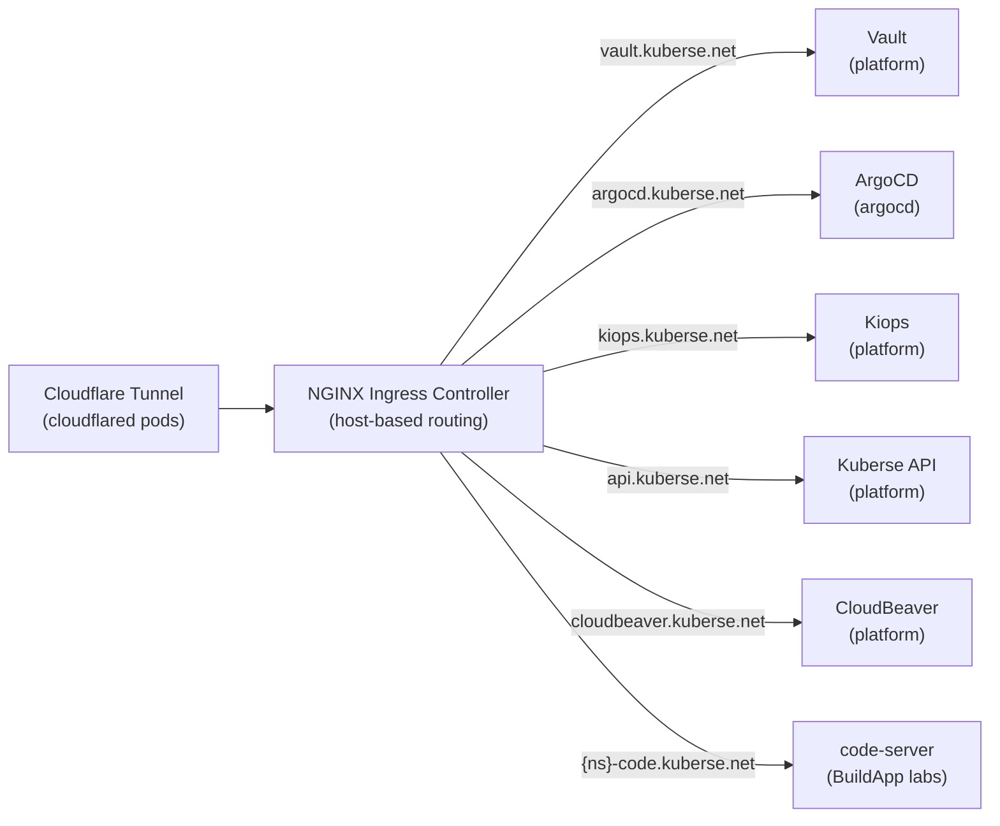

# Ingress NGINX

> Internal HTTP/HTTPS traffic routing via the NGINX Ingress Controller.

| Property | Value |
|----------|-------|
| **Chart** | `platform/charts/ingress-nginx/` (wrapper, no custom templates) |
| **Sync Wave** | 1 |
| **Namespace** | `platform` |
| **Upstream Chart** | `ingress-nginx` v4.11.3 from `https://kubernetes.github.io/ingress-nginx` |
| **Dependencies** | Namespaces (Wave -1) |

## Overview

A **wrapper chart** around the official NGINX Ingress Controller Helm chart. It provides no custom templates -- all resources come from the upstream dependency, configured via `values.yaml` passthrough. The Ingress Controller is the central HTTP router: all traffic from Cloudflare Tunnel and all internal Ingress resources flow through it.

## Architecture



## Resources Created (via upstream chart)

| Resource | Description |
|----------|-------------|
| Deployment | NGINX Ingress Controller pods |
| Service (NodePort) | HTTP on port 30080, HTTPS on port 30443 |
| IngressClass | Set as cluster default (`isDefault: true`) |
| ConfigMap | Controller configuration |
| ServiceAccount + RBAC | Required permissions for the controller |

## Configuration

| Setting | Value | Reason |
|---------|-------|--------|
| `controller.service.type` | `NodePort` | Local access via node IP + port |
| `controller.service.nodePorts.http` | `30080` | Fixed HTTP port |
| `controller.service.nodePorts.https` | `30443` | Fixed HTTPS port |
| `controller.hostPort.enabled` | `false` | Not needed -- Cloudflare Tunnel handles external access |
| `controller.hostNetwork` | `false` | Standard pod networking |
| `controller.ingressClassResource.default` | `true` | Default IngressClass for all Ingress resources |
| `controller.config.ssl-redirect` | `false` | Cloudflare handles TLS termination |
| `controller.config.use-forwarded-headers` | `true` | Trust headers from Cloudflare proxy |
| `controller.config.compute-full-forwarded-for` | `true` | Full `X-Forwarded-For` chain |
| `controller.metrics.enabled` | `true` | Prometheus metrics enabled |
| `controller.resources.limits` | 200m CPU, 256Mi | Resource limits |
| `controller.resources.requests` | 100m CPU, 90Mi | Resource requests |

## Why SSL Redirect is Disabled

Cloudflare Edge terminates TLS for all public traffic. By the time requests reach the NGINX controller (via the Cloudflare Tunnel), they are already decrypted HTTP. Enabling SSL redirect would cause infinite redirect loops.

## Why Forwarded Headers are Enabled

Traffic passes through Cloudflare Edge -> Tunnel -> cloudflared pod -> NGINX. Without forwarded header support, NGINX would see the `cloudflared` pod IP as the client IP instead of the actual user's IP.

## Vault Integration

**None.** This module has no secrets and no Vault dependency.

## Interactions with Other Modules

| Module | Interaction |
|--------|------------|
| **Cloudflare Tunnel** | Routes all public traffic to `ingress-nginx-controller.platform.svc.cluster.local:80`. Init containers in cloudflared wait for NGINX to be ready. |
| **Vault** | Creates Ingress resource for `vault.kuberse.net` |
| **ArgoCD Config** | Creates Ingress resource for `argocd.kuberse.net` |
| **Kiops** | Creates Ingress resource for `kiops.kuberse.net` |
| **Kuberse API** | Creates Ingress resource for `api.kuberse.net` |
| **CloudBeaver** | Creates Ingress resource for `cloudbeaver.kuberse.net` |
| **BuildApp (code-server)** | Creates Ingress resources for `{namespace}-code.kuberse.net` (one per lab, covered by `*.kuberse.net` wildcard) |
| **k3s** | k3s is configured with `--disable=traefik --disable=servicelb` to avoid conflicting with ingress-nginx |

## Debugging

```bash
# Check controller pods
kubectl get pods -n platform | grep ingress

# View controller logs
kubectl logs -f deploy/ingress-nginx-controller -n platform

# List all Ingress resources cluster-wide
kubectl get ingress --all-namespaces

# Check IngressClass
kubectl get ingressclass

# Test connectivity via NodePort
curl http://<node-ip>:30080 -H "Host: vault.kuberse.net"
```
