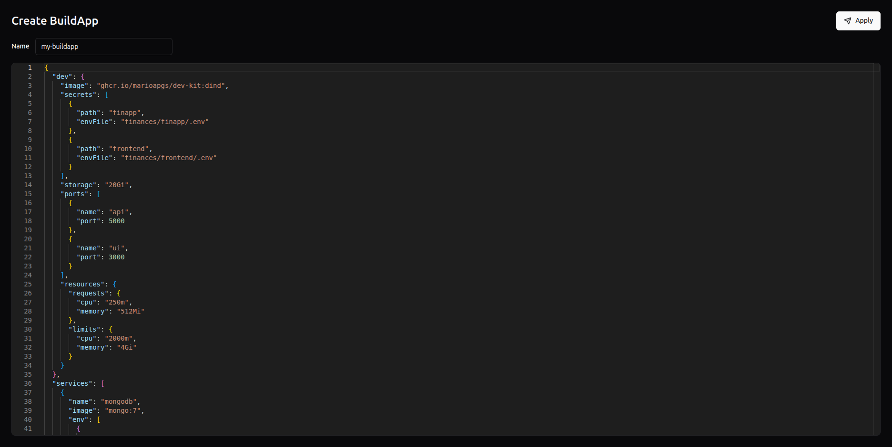

# Create a BuildApp

BuildApps are on-demand development environments managed by Kuberse. They are useful when you need an isolated workspace with a dev container, optional services, ports, storage, secrets, and repositories.

Open the creation page at:

```text
https://kubrain.kuberse.net/buildapp
```



## Create Flow

1. Open **BuildApp** from the sidebar.
2. Set a DNS-compatible name in the **Name** field.
3. Edit the JSON values in the editor.
4. Click **Apply**.
5. Kubrain creates the BuildApp and returns you to the Catalog.

## What Kubrain Creates

When you apply a BuildApp, Kubrain provisions the environment and registers it in the catalog. The backend also coordinates the required GitOps and secret lifecycle so the environment can be managed through ArgoCD and Vault.

From the user's point of view, the BuildApp becomes visible in the Catalog and can later be edited or deleted from the entity details panel.

## Values Format

The editor accepts JSON. The default example includes the main `dev` container, extra services, secrets, and repositories.

```json
{
  "dev": {
    "image": "ghcr.io/marioapgs/dev-kit:dind",
    "secrets": [
      {
        "path": "finapp",
        "envFile": "finances/finapp/.env"
      }
    ],
    "storage": "20Gi",
    "ports": [
      {
        "name": "api",
        "port": 5000
      }
    ],
    "resources": {
      "requests": {
        "cpu": "250m",
        "memory": "512Mi"
      },
      "limits": {
        "cpu": "2000m",
        "memory": "4Gi"
      }
    }
  },
  "services": [
    {
      "name": "mongodb",
      "image": "mongo:7",
      "env": [
        {
          "name": "MONGO_INITDB_DATABASE",
          "value": "devdb"
        }
      ],
      "secrets": ["mongo"],
      "ports": [
        {
          "name": "mongo",
          "port": 27017
        }
      ],
      "storage": {
        "mountPath": "/data/db",
        "size": "10Gi"
      }
    }
  ],
  "secrets": [
    {
      "key": "MONGO_INITDB_ROOT_USERNAME",
      "value": "admin",
      "path": "mongo"
    }
  ],
  "repos": ["https://github.com/marioapgs/finances.git"]
}
```

## Common Fields

| Field | Description |
|-------|-------------|
| `dev.image` | Container image for the main development container |
| `dev.storage` | Persistent storage size for the workspace |
| `dev.ports` | Ports exposed by the development container |
| `dev.resources` | CPU and memory requests/limits |
| `services` | Additional containers such as databases, queues, or caches |
| `secrets` | Secret values grouped by path |
| `repos` | Git repositories cloned or made available in the environment |

## Validation

Kubrain validates that:

- The name is not empty.
- The values editor contains valid JSON.

If validation fails, an error appears near the **Apply** button.

## After Creation

After the BuildApp is created:

1. Open the Catalog.
2. Search for the BuildApp name.
3. Select it to inspect details.
4. Use the available actions to edit, delete, or inspect its ArgoCD resources.
