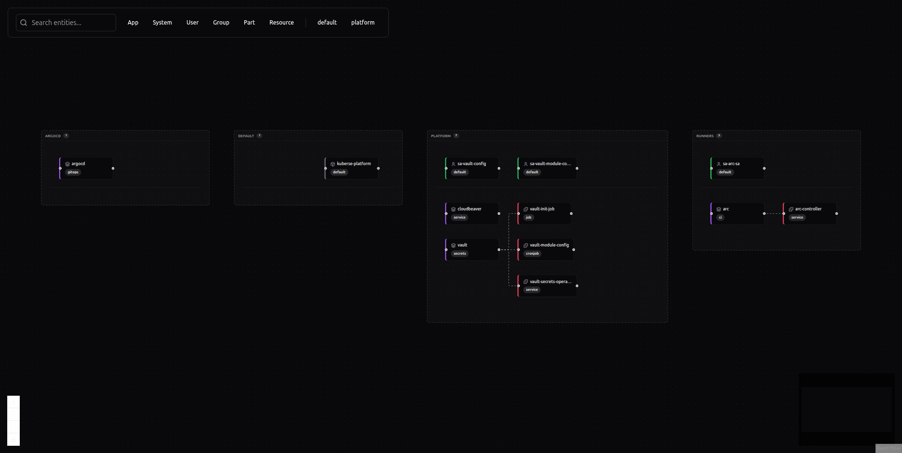

# Catalog

The Catalog is Kubrain's main view. It shows platform entities as an interactive topology graph so you can understand what exists, where it lives, and how it connects to other entities.

Open it at:

```text
https://kubrain.kuberse.net/nodes
```

## What the Catalog Shows

The graph includes catalog entities such as:

| Kind | Meaning |
|------|---------|
| `System` | A logical product, platform area, or grouped capability |
| `App` | A deployable application or service |
| `Resource` | Supporting infrastructure or Kubernetes-managed resource |
| `Part` | A sub-component of a larger entity |
| `User` / `Group` | Ownership and identity entities |

Entities are grouped visually by namespace and connected by relations. This makes it easier to see ownership, dependencies, and platform boundaries.



## Search and Filters

Use the filter bar to narrow the graph:


Available filters:

| Control | Use it to |
|---------|-----------|
| Search box | Find entities by name |
| Kind chips | Show only apps, systems, users, groups, parts, or resources |
| Namespace chips | Focus on entities in a namespace such as `platform` or `default` |

## Graph Controls

The Catalog graph includes standard graph controls:

| Control | Purpose |
|---------|---------|
| Zoom in / out | Inspect dense areas or see the broader map |
| Fit view | Re-center the graph around visible entities |
| Toggle interactivity | Lock or unlock graph interactions |
| Minimap | Navigate large graphs quickly |

## Entity Details

Click an entity to open the details panel. Depending on the entity, the panel can show:

- Name, kind, namespace, and type
- Description and tags
- Links to external systems
- Relationships to other catalog entities
- Status information
- Actions for BuildApp entities
- A link to view ArgoCD resources when the entity is associated with an ArgoCD application

## Typical Uses

- Find the owner or namespace of a service.
- See which resources belong to a platform module.
- Jump from a catalog app to its live ArgoCD resources.
- Locate BuildApps and manage their lifecycle.
- Understand how systems and services are connected.
