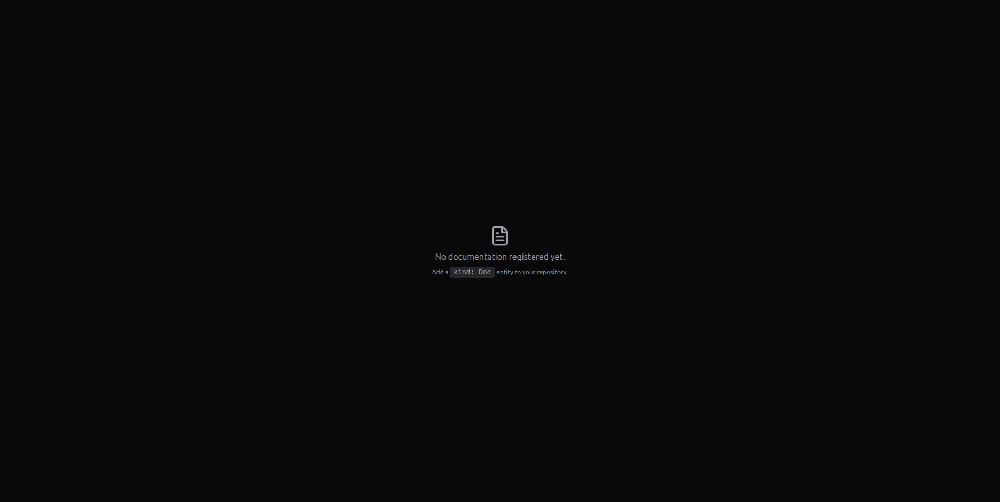

# Docs Portal

Kubrain includes a documentation portal that renders markdown documentation from repositories registered in the catalog.

Open it at:

```text
https://kubrain.kuberse.net/docs
```

If no documentation entities have been registered yet, Kubrain shows an empty state:



## What the Docs Portal Supports

The docs viewer supports:

- Headings, paragraphs, lists, and tables
- Inline code and fenced code blocks
- Mermaid diagrams
- Links and images
- Documentation navigation from the entity's `spec.nav`
- Dark/light styling consistent with the rest of Kubrain

## Register Documentation

Add a catalog entity with `kind: Doc` to your repository:

```yaml
kind: Doc
type: internal
metadata:
  name: my-service-docs
  namespace: default
  description: Documentation for my service
spec:
  docs_dir: docs
  nav:
    - Home: index.md
    - Guide:
      - Getting Started: guide/getting-started.md
      - API Reference: guide/api-reference.md
```

After the repository is ingested, the docs appear in `/docs`.

## How Content Is Loaded

1. Kubrain discovers the `kind: Doc` entity during catalog ingestion.
2. The entity points to a repository and a `docs_dir`.
3. When a user opens a page, Kubrain fetches the markdown file on demand.
4. The frontend renders the markdown with navigation and Mermaid support.

## Recommended Repository Layout

```text
docs/
  index.md
  guide/
    getting-started.md
    api-reference.md
```

Keep `spec.nav` aligned with files that actually exist under `spec.docs_dir`.

## Security Note

Kubrain validates requested documentation paths against the navigation tree. This prevents arbitrary path traversal outside the registered docs structure.
