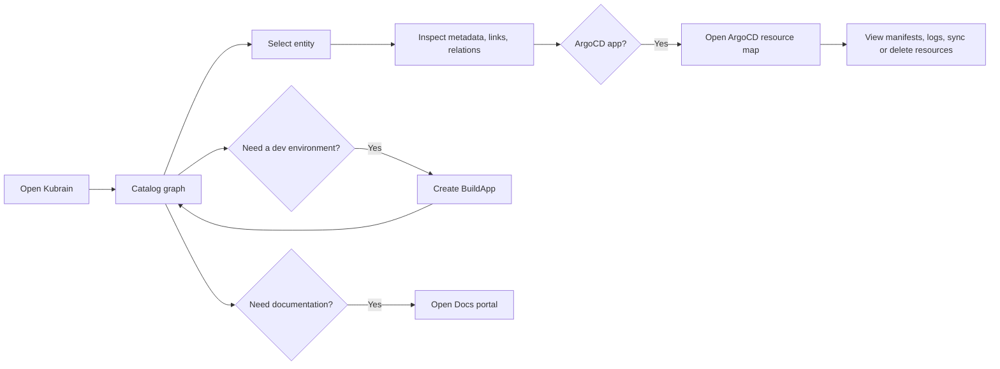

# Kubrain

> Kubrain is the Kuberse control plane UI: a visual catalog, BuildApp launcher, live ArgoCD resource explorer, and documentation portal.

| Property | Value |
|----------|-------|
| **URL** | `https://kubrain.kuberse.net` |
| **Main Route** | `/nodes` |
| **User Features** | Catalog graph, ArgoCD resources, BuildApp creation/editing, docs portal |

## What You Can Do

Kubrain gives platform users a single place to understand and operate the Kuberse platform:

| Feature | Route | What it is for |
|---------|-------|----------------|
| **Catalog** | `/nodes` | Explore systems, apps, resources, users, groups, and their relationships as an interactive graph |
| **ArgoCD Resources** | `/nodes/argocd?app=<app>` | Inspect live Kubernetes resources for an ArgoCD application, including health, sync status, manifests, logs, and actions |
| **BuildApps** | `/buildapp` | Create development environments from JSON values and manage existing BuildApps from the catalog |
| **Docs Portal** | `/docs` | Browse markdown documentation registered as `kind: Doc` catalog entities |

## Recommended First Steps

1. Open `https://kubrain.kuberse.net`.
2. Use the sidebar menu to switch between Catalog, BuildApp, and Docs.
3. Start in **Catalog** to understand what is deployed and how things relate.
4. Select an entity to open its details panel.
5. For entities connected to ArgoCD, open **ArgoCD Resources** to inspect live Kubernetes objects.

## Core Workflow

## Authentication

Kubrain is normally exposed through Cloudflare Access at `kubrain.kuberse.net`. If your browser is not already authenticated, Cloudflare will prompt you before Kubrain loads.

Kubrain itself does not currently expose a separate login/logout screen inside the application.

## Screenshots

The screenshots in this documentation show representative UI sections. They are intentionally cropped to focus on the relevant controls instead of full-page captures.

## Related Guides

- [Using the Catalog](catalog/overview.md)
- [ArgoCD Resources](catalog/argocd-resources.md)
- [Creating BuildApps](buildapps/create-buildapp.md)
- [Using the Docs Portal](docs-portal/overview.md)
- [Routes Reference](reference/routes.md)
