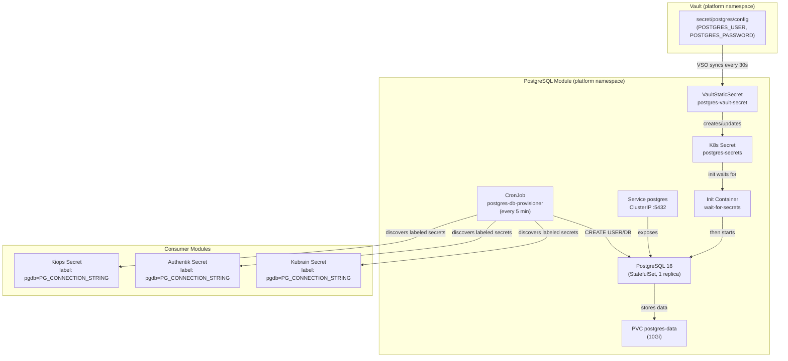
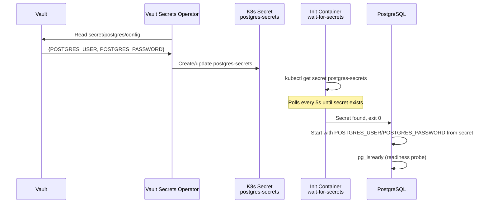

# PostgreSQL

> Shared PostgreSQL 16 server with Vault-managed credentials and automated database provisioning via CronJob discovery.

| Property | Value |
|----------|-------|
| **Chart** | `platform/charts/postgres/` |
| **Sync Wave** | 1 |
| **Namespace** | `platform` |
| **Dependencies** | Namespaces (Wave -1), Vault (Wave 1) |
| **Image** | `postgres:16-alpine` |

## Overview

The PostgreSQL module deploys a **single-replica PostgreSQL 16 server** in the `platform` namespace. It serves as the shared database for all platform modules that need relational storage (Kiops, Authentik, Kubrain, etc.).

The module has two key automation components:

1. **Vault integration** -- Admin credentials (`POSTGRES_USER`, `POSTGRES_PASSWORD`) are stored in Vault and synced to a Kubernetes Secret via the VSO. PostgreSQL does not start until this secret exists.
2. **Database Provisioner CronJob** -- A Python-based CronJob that runs every 5 minutes, discovers Kubernetes Secrets labeled `pgdb=<key>` across the cluster, and automatically creates the requested databases and users in PostgreSQL.

## Architecture



## Resources Created

| Resource | Name | Description |
|----------|------|-------------|
| StatefulSet | `postgres` (1 replica) | PostgreSQL 16 server pod |
| PVC | `postgres-data` | 10Gi persistent volume for database files |
| Service | `postgres` | ClusterIP service on port 5432 |
| CronJob | `postgres-db-provisioner` | Discovers labeled secrets and provisions databases every 5 min |
| ConfigMap | `postgres-provisioner-script` | Embeds the Python provisioning script |
| ServiceAccount | `postgres-db-provisioner` | SA for the provisioner CronJob |
| ClusterRole | `postgres-db-provisioner` | Permissions to list secrets and namespaces cluster-wide |
| ServiceAccount | `postgres-sa` | SA for Vault authentication (when vault.enabled) |
| VaultConnection | `vault-connection` | Connection to Vault server |
| VaultAuth | `postgres-auth` | Kubernetes auth for the `postgres-role` |
| VaultStaticSecret | `postgres-vault-secret` | Syncs `secret/postgres/config` to `postgres-secrets` |
| ConfigMap | `postgres-vault-role` | Labeled `vault: setup-creds` for auto-discovery by the Vault CronJob |

## Startup Sequence

PostgreSQL does not start until its admin credentials are available from Vault:



The init container (`alpine/k8s:1.28.2`) runs `kubectl get secret postgres-secrets` in a loop, blocking the PostgreSQL container from starting until the VSO has synced the admin credentials from Vault.

## Configuration

Key settings from `values.yaml`:

| Setting | Value | Description |
|---------|-------|-------------|
| `image.tag` | `16-alpine` | PostgreSQL version |
| `replicas` | `1` | Number of replicas |
| `persistence.size` | `10Gi` | Data volume size |
| `service.port` | `5432` | PostgreSQL port |
| `dbProvisioner.cronSchedule` | `*/5 * * * *` | Provisioner CronJob frequency |
| `dbProvisioner.namespaceToSearch` | `null` | Namespace filter (`null` = all, `[]` = disabled, `[list]` = specific) |
| `vault.secretPath` | `postgres/config` | Vault KV v2 path for admin credentials |
| `vault.role.paths` | `secret/data/postgres/*` | Vault paths the module can access |

## Security Considerations

> **This setup is designed for development/learning with Minikube/K3s.** For production, consider:

1. Use a managed PostgreSQL service (RDS, Cloud SQL, etc.)
2. Enable SSL connections (`ssl = on`)
3. Restrict `dbProvisioner.namespaceToSearch` to specific namespaces instead of `null` (all)
4. Use connection pooling (PgBouncer)
5. Configure regular backups

## Debugging

```bash
# Check PostgreSQL pod status
kubectl get pods -n platform -l app.kubernetes.io/name=postgres

# View PostgreSQL logs
kubectl logs -f statefulset/postgres -n platform

# Check if admin credentials secret exists
kubectl get secret postgres-secrets -n platform

# View provisioner CronJob logs
kubectl logs -n platform -l job-name --tail=100

# Connect to PostgreSQL directly
kubectl exec -it postgres-0 -n platform -- psql -U <user> -d postgres

# List all databases
kubectl exec -it postgres-0 -n platform -- psql -U <user> -d postgres -c '\l'

# List all roles
kubectl exec -it postgres-0 -n platform -- psql -U <user> -d postgres -c '\du'

# Check which secrets have the pgdb label
kubectl get secrets -A -l pgdb --show-labels
```
