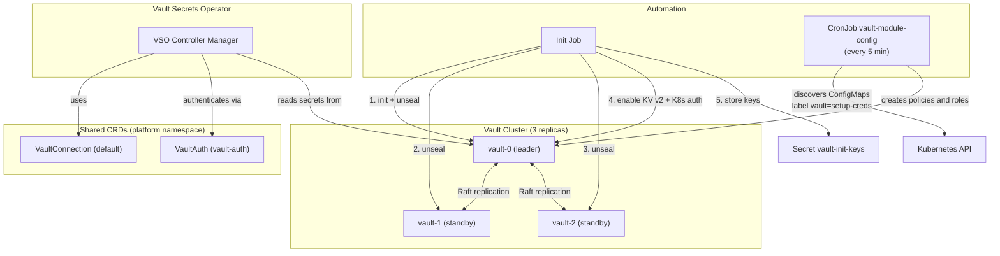

# Vault

> Centralized secrets management system with high availability, auto-initialization, and auto-unseal.

| Property | Value |
|----------|-------|
| **Chart** | `platform/charts/vault/` |
| **Sync Wave** | 1 |
| **Namespace** | `platform` |
| **Dependencies** | Namespaces (Wave -1), Ingress NGINX (Wave 1) |
| **Subcharts** | HashiCorp Vault 0.28.0, Vault Secrets Operator (VSO) 0.10.0 |

## Overview

The Vault module deploys a **3-replica HashiCorp Vault cluster** with Raft storage for high availability, along with the **Vault Secrets Operator (VSO)** that automatically synchronizes Vault secrets into Kubernetes Secrets. It includes custom automation that initializes, unseals, and configures Vault without manual intervention.

## Architecture



## Resources Created

| Resource | Name | Description |
|----------|------|-------------|
| StatefulSet | `vault` (3 replicas) | Vault server pods with Raft storage (10Gi per replica) |
| Deployment | `vault-secrets-operator` | VSO controller that syncs secrets to K8s |
| ConfigMap | `vault-init-script` | Bash script for init + unseal automation |
| Job | `vault-init-job` | Runs the init script after Vault pods are ready |
| CronJob | `vault-module-config` | Every 5 minutes discovers modules and configures policies/roles in Vault |
| ServiceAccount | `vault-config` | SA for the Init Job |
| ServiceAccount | `vault-module-config` | SA for the discovery CronJob |
| VaultConnection | `default` | Shared connection: `http://vault.platform.svc.cluster.local:8200` |
| VaultAuth | `vault-auth` | Shared auth config for the VSO operator |
| Ingress | `vault` | External access at `vault.kuberse.net` |

## Configuration

Key settings from `values.yaml`:

| Setting | Value | Description |
|---------|-------|-------------|
| `vault.server.ha.replicas` | `3` | Number of Vault pods |
| `vault.server.ha.raft.enabled` | `true` | Raft consensus storage |
| `vault.server.dataStorage.size` | `10Gi` | Persistent volume per replica |
| `vault.server.image.tag` | `1.19.0` | Vault server version |
| `vaultConfig.initSecretName` | `vault-init-keys` | K8s Secret storing keys + root token |
| `moduleConfig.schedule` | `*/5 * * * *` | Module discovery CronJob frequency |
| `ingress.host` | `vault.kuberse.net` | External hostname |
| `vault.injector.namespaceSelector` | `vault-injection: enabled` | Namespaces where the injector operates |

## Initialization Workflow

The Init Job runs a bash script that performs the following steps:

1. **Wait for StatefulSet**: Polls until the `vault` StatefulSet reaches the desired replica count
2. **Wait for Pods**: Ensures all 3 Vault pods are in `Running` state
3. **Check init status**: Queries the `/sys/health` endpoint via `kubectl exec`
4. **Initialize** (if needed): Runs `vault operator init` with 5 key shares and a threshold of 3
5. **Store keys**: Creates the `vault-init-keys` Kubernetes Secret with all 5 unseal keys and the root token
6. **Unseal all pods**: Iterates through each Vault pod and applies 3 unseal keys
7. **Enable KV v2**: Creates secret engines at the `secret/` and `buildapps/` paths
8. **Enable Kubernetes Auth**: Configures the `kubernetes` auth method
9. **Create VSO policy**: Grants the VSO operator read access to `secret/data/*` and `buildapps/data/*`
10. **Create VSO role**: Binds the policy to the VSO controller manager ServiceAccount

## Init Job vs. Module Config CronJob

These are two separate automation components with distinct responsibilities:

| Aspect | Init Job | Module Config CronJob |
|--------|----------|----------------------|
| **Runs** | Once (after Vault pods are ready) | Every 5 minutes |
| **Purpose** | Initialize Vault, unseal, enable engines + auth, create VSO role | Discover modules and create their policies/roles |
| **Creates** | `secret/` engine, `buildapps/` engine, `kubernetes` auth method, VSO policy/role | Per-module policies and roles (e.g. `postgres-policy`, `kiops-role`) |
| **Prerequisite** | Vault pods running | Init Job must have completed (Vault unsealed + auth enabled) |

**The Init Job must succeed before the CronJob can function.** If the Init Job fails, no modules will get their Vault roles and all VaultStaticSecrets will fail to authenticate.

## Re-sealing and Pod Restarts

Vault seals itself when pods restart. The Init Job script handles both initial initialization AND re-unsealing:

- If Vault is already initialized (keys exist in `vault-init-keys` Secret), the script skips initialization and only performs unsealing
- ArgoCD keeps the Init Job synced, so if pods restart, ArgoCD re-runs the Job to unseal

**If all 3 pods restart simultaneously** (e.g., node drain), Vault will be sealed until ArgoCD re-syncs the Init Job or you manually unseal. In practice, ArgoCD's self-heal triggers this within seconds.

## Eventual Consistency

Modules deployed in the same sync wave as Vault may initially fail to authenticate with Vault because:
1. The CronJob hasn't yet created their policy/role (up to 5 min delay)
2. The VSO can't read secrets until the role exists

**This is handled automatically:** the VSO retries authentication on its refresh interval (30s). Within 5 minutes of deployment, all modules will have their Vault access configured. No manual intervention is needed.

## Security Considerations

> **This setup is designed for development/learning with Minikube/K3s.** For production, consider:

1. Enable TLS (`tlsDisable: false`)
2. Use auto-unseal with Azure Key Vault, AWS KMS, etc.
3. Store unseal keys externally, not in Kubernetes Secrets
4. Configure audit logs
5. Implement granular access policies

## Debugging

```bash
# Vault status
kubectl exec -it vault-0 -n platform -- vault status

# Raft cluster peers
kubectl exec -it vault-0 -n platform -- vault operator raft list-peers

# VSO logs
kubectl logs -f deploy/vault-secrets-operator-controller-manager -n platform

# View root token (sensitive!)
kubectl get secret vault-init-keys -n platform -o jsonpath='{.data.root-token}' | base64 -d

# Init Job logs
kubectl logs job/vault-init-job -n platform

# Module config CronJob logs
kubectl logs -n platform -l job-name --tail=100

# Check pod status
kubectl get pods -n platform -l app.kubernetes.io/name=vault
```
