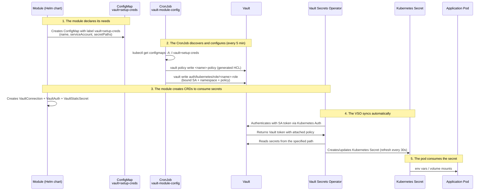
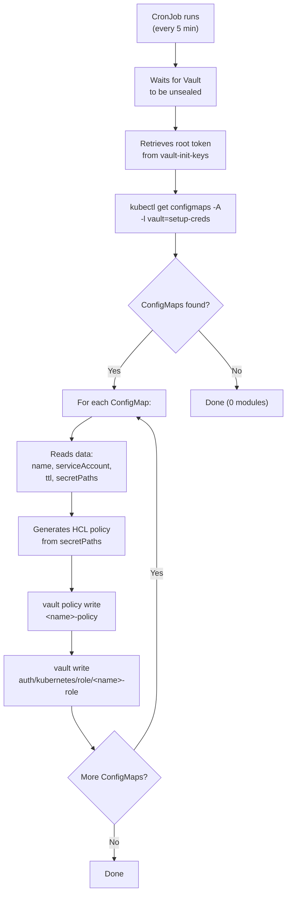
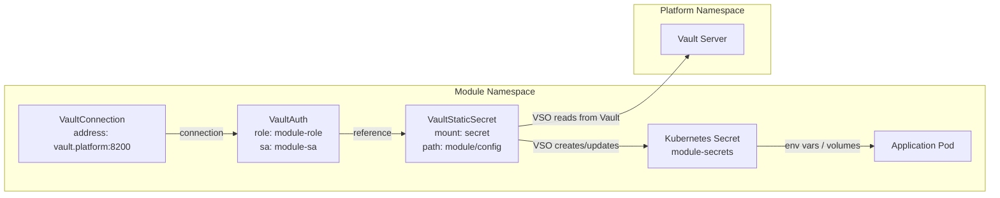

# Secrets Management

This document explains how secrets are managed across the Kuberse platform using HashiCorp Vault, the Vault Secrets Operator (VSO), and the automatic module discovery CronJob.

## Core Principle

**No secret is ever hardcoded** in `values.yaml`, templates, or any file in the repository. All platform secrets are centralized in Vault and automatically synchronized to Kubernetes Secrets via the VSO.

## End-to-End Secret Flow



## Secret Engines (KV v2)

Vault is configured with two KV v2 secret engines:

| Mount Path | Purpose | Consumers |
|------------|---------|-----------|
| `secret/` | Platform module secrets | Kiops, Kuberse API, ArgoCD, PostgreSQL, Authentik, CloudBeaver, etc. |
| `buildapps/` | Dynamic lab secrets | BuildApp environments (per-namespace isolation) |

### Path Convention

```
secret/
├── kiops/
│   └── config          # Kiops environment variables
├── kuberse-api/
│   └── config          # API configuration and tokens
├── argocd/
│   └── oauth           # GitHub OAuth for Dex SSO
├── postgres/
│   └── config          # POSTGRES_PASSWORD, POSTGRES_USER, POSTGRES_DB
├── authentik/
│   └── config          # Authentik credentials
├── cloudbeaver/
│   └── config          # CloudBeaver admin credentials

buildapps/
├── lab-alpha/
│   └── config          # Lab-specific secrets
├── lab-beta/
│   └── config
└── ...
```

## Automatic Module Discovery

### How the `vault-module-config` CronJob Works

The CronJob runs **every 5 minutes** and is responsible for automatically creating Vault policies and roles for each platform module.



### How to Register a Module

For a module to be discovered by the CronJob, it must create a **ConfigMap with the label `vault: setup-creds`**. This ConfigMap is defined in the module's Helm chart, typically in `templates/vault-role-configmap.yaml`:

```yaml
apiVersion: v1
kind: ConfigMap
metadata:
  name: {{ .Release.Name }}-vault-role
  namespace: {{ .Values.namespace }}
  labels:
    vault: setup-creds      # <-- Label the CronJob searches for
data:
  name: "my-module"                          # Module name (generates <name>-policy and <name>-role)
  serviceAccount: "my-module-sa"             # ServiceAccount bound to the Vault role
  ttl: "24h"                                 # Vault token TTL (defaults to 24h)
  secretPaths: |                             # Paths and capabilities (format: path:cap1,cap2)
    secret/data/my-module/*:read,list
    secret/metadata/my-module/*:read,list
```

The `secretPaths` field defines the Vault paths and capabilities the module needs. The format is `path:capability1,capability2` per line. The CronJob automatically generates the HCL policy from these lines:

```hcl
# Auto-generated by vault-module-config
path "secret/data/my-module/*" {
  capabilities = ["read", "list"]
}
path "secret/metadata/my-module/*" {
  capabilities = ["read", "list"]
}
```

### CronJob Permissions

The CronJob has a ServiceAccount `vault-module-config` with the following permissions:

| Scope | Resources | Actions |
|-------|-----------|---------|
| **Namespace `platform`** | pods, pods/exec, secrets | get, list, watch, create, update, patch |
| **Cluster-wide** | namespaces, serviceaccounts, configmaps | get, list, watch |

This allows it to discover ConfigMaps in any namespace and execute commands inside Vault pods.

## Integration Pattern (3 CRDs)

Every module that needs to consume Vault secrets follows the same 3-resource pattern:

### 1. VaultConnection

Defines how to connect to the Vault server:

```yaml
apiVersion: secrets.hashicorp.com/v1beta1
kind: VaultConnection
metadata:
  name: vault-connection
  namespace: <module-namespace>
spec:
  address: http://vault.platform.svc.cluster.local:8200
```

### 2. VaultAuth

Defines how to authenticate with Vault using the Kubernetes method:

```yaml
apiVersion: secrets.hashicorp.com/v1beta1
kind: VaultAuth
metadata:
  name: <module>-auth
  namespace: <module-namespace>
spec:
  method: kubernetes
  mount: kubernetes
  vaultConnectionRef: vault-connection
  kubernetes:
    role: <module>-role         # Role created by the CronJob
    serviceAccount: <module>-sa  # SA bound to the role
    audiences:
      - vault
```

### 3. VaultStaticSecret

Defines which secret to sync and where to store it:

```yaml
apiVersion: secrets.hashicorp.com/v1beta1
kind: VaultStaticSecret
metadata:
  name: <module>-vault-secret
  namespace: <module-namespace>
spec:
  type: kv-v2
  mount: secret
  path: <module>/config
  destination:
    name: <module>-secrets    # Resulting K8s Secret name
    create: true
  refreshAfter: 30s           # Automatic refresh every 30 seconds
  vaultAuthRef: <module>-auth
```

The VSO watches for `VaultStaticSecret` resources, authenticates with Vault using the `VaultAuth` configuration, reads the secret from the specified path, and creates or updates a Kubernetes Secret in the same namespace. It refreshes every 30 seconds to pick up changes.

### Integration Pattern Diagram



## Secret Transformation

Some modules need secrets in a specific format. `VaultStaticSecret` supports transformations:

### Example: ArgoCD OAuth

Vault stores: `{ "clientSecret": "..." }`

The VaultStaticSecret transforms it into the format ArgoCD expects:

```yaml
spec:
  destination:
    name: argocd-oauth-secrets
    transformation:
      excludeRaw: true
      templates:
        dex.github.clientSecret:
          text: "{{ .Secrets.clientSecret }}"
```

## Policies and Roles per Module

| Module | ServiceAccount | Vault Role | Policy | Access |
|--------|---------------|------------|--------|--------|
| Kiops | `kiops` | `kiops-role` | `kiops-policy` | `secret/data/kiops/*` |
| Kuberse API | `kuberse-api-sa` | `kuberse-api-role` | `kuberse-api-policy` | `secret/data/kuberse-api/*` |
| ArgoCD | `argocd-server` | `argocd-role` | `argocd-policy` | `secret/data/argocd/*` |
| PostgreSQL | `postgres-sa` | `postgres-role` | `postgres-policy` | `secret/data/postgres/*` |
| Authentik | `authentik-sa` | `authentik-role` | `authentik-policy` | `secret/data/authentik/*` |
| CloudBeaver | `cloudbeaver-sa` | `cloudbeaver-role` | `cloudbeaver-policy` | `secret/data/cloudbeaver/*` + `secret/data/postgres/*` |
| Kubrain | `kubrain-sa` | `kubrain-role` | `kubrain-policy` | `secret/data/kubrain/*` |
| Gitea | `gitea-sa` | `gitea-role` | `gitea-policy` | `secret/data/gitea/*` |
| VSO | `vault-secrets-operator-controller-manager` | `vault-secrets-operator-role` | `vault-secrets-operator-policy` | `secret/data/*`, `buildapps/data/*` |

> Each module can only access its own secrets (least privilege principle). The VSO is the only exception, as it needs to read all paths to sync secrets for any module.

## BuildApp: Dynamic Secrets

BuildApp environments have a special lifecycle managed by the **kuberse-api** (not by the CronJob):

1. **Create**: When a new lab is provisioned, the API creates a Vault policy and role scoped to `buildapps/<namespace>/*`
2. **Sync**: The BuildApp chart creates VaultStaticSecret resources to pull secrets into the lab namespace
3. **Destroy**: When the lab is deleted, the API removes the Vault policy, role, and all secrets under the namespace path

## Storing Secrets in Vault

Secrets must be stored in Vault **before** the consuming module is deployed:

```bash
# Store a secret
kubectl exec -it vault-0 -n platform -- vault kv put \
  secret/my-module/config \
  API_KEY=secretvalue \
  DB_PASSWORD=anothersecret

# Read a secret
kubectl exec -it vault-0 -n platform -- vault kv get secret/my-module/config

# List secrets
kubectl exec -it vault-0 -n platform -- vault kv list secret/

# Delete a secret
kubectl exec -it vault-0 -n platform -- vault kv delete secret/my-module/config
```

> **Note**: Always use `kubectl exec` -- never `kubectl port-forward` to access Vault.
