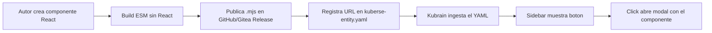
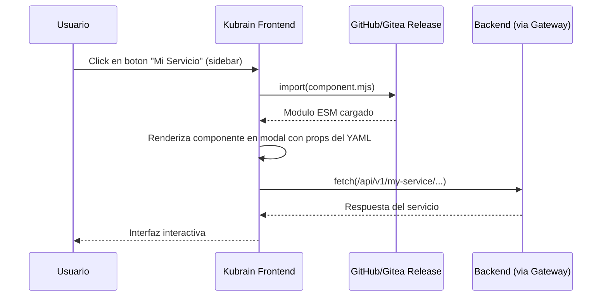
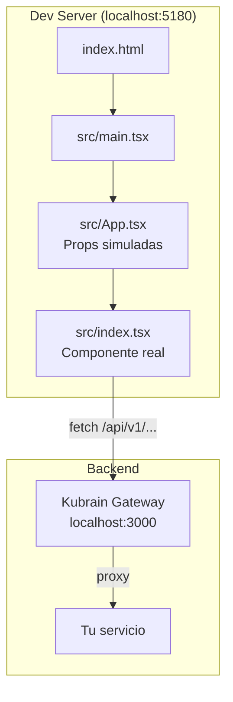
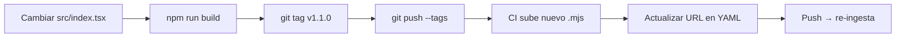

# Kubrain Apps (Componentes UI Remotos)

## Que es una App?

Una app es un componente React que se integra dinamicamente en el frontend de Kubrain.
Permite que los autores de servicios publiquen interfaces de gestion que aparecen
directamente en kubrain sin necesidad de modificar el codigo de kubrain.



---

## Como funciona



El componente remoto comparte la misma instancia de React que kubrain gracias a un
**import map** definido en el `index.html`. Cuando el browser carga `component.mjs`
y este hace `import { useState } from 'react'`, el import map redirige al React
ya cargado por kubrain.

---

## Lifecycle completo

### Paso 1: Crear el proyecto

Copia el template `plugins/_app` a un nuevo repositorio:

```bash
cp -r plugins/_app my-service-ui
cd my-service-ui
npm install
```

Personaliza:
- `package.json` → nombre del paquete
- `kuberse-entity.yaml` → nombre del servicio, host, URL del release
- `src/index.tsx` → tu componente

### Paso 2: Desarrollo local

```bash
npm run dev
```

Levanta un servidor React completo en `http://localhost:5180` con:
- Hot-reload
- Proxy configurado a kubrain (`/api/*` → `localhost:3000`)
- React DevTools



El archivo `src/App.tsx` actua como wrapper de desarrollo: simula las props que
kubrain pasaria en produccion. Modificalo para probar diferentes escenarios.

### Paso 3: Build

```bash
npm run build
# Resultado: dist/component.mjs
```

El build genera un unico archivo ESM con:
- Tu codigo del componente
- Cualquier libreria que importes (excepto React)
- React marcado como external (no se incluye, ~0 bytes de React en el bundle)

Tamano tipico: 5-50KB dependiendo de tu codigo.

### Paso 4: Publicar

Crea un tag y haz push:

```bash
git tag v1.0.0
git push origin main --tags
```

El CI automaticamente:
1. Ejecuta `npm ci && npm run build`
2. Crea un Release
3. Sube `dist/component.mjs` como asset

URL resultante:
- GitHub: `https://github.com/<owner>/<repo>/releases/download/v1.0.0/component.mjs`
- Gitea: `https://gitea.example.com/<owner>/<repo>/releases/download/v1.0.0/component.mjs`

### Paso 5: Registrar en Kubrain

En el `kuberse-entity.yaml` de tu servicio (el que kubrain ingesta via GitHub/Gitea):

```yaml
spec:
  api:
    - name: my-service
      host: http://my-service.namespace.svc.cluster.local:8080

  app:
    - component: https://github.com/<owner>/<repo>/releases/download/v1.0.0/component.mjs
      display: sidebar
      title: Mi Servicio
      icon: https://example.com/icon.svg
      props:
        apiHost: /api/v1/my-service
```

Push → kubrain ingesta → el boton aparece en el sidebar.

### Paso 6: Actualizar



---

## Estructura del template

```
_app/
├── .github/workflows/release.yaml   # CI para GitHub Actions
├── .gitea/workflows/release.yaml    # CI para Gitea Actions
├── .gitignore
├── index.html                       # HTML del dev server (no se exporta)
├── kuberse-entity.yaml              # Ejemplo de registro en kubrain
├── package.json
├── tsconfig.json
├── vite.config.ts                   # Dual: dev server + lib build
└── src/
    ├── main.tsx                     # Entry point dev (no se exporta)
    ├── App.tsx                      # Wrapper dev con props simuladas
    └── index.tsx                    # COMPONENTE REAL (export default)
```

---

## Configuracion dual de Vite

El `vite.config.ts` usa el flag `--mode lib` para diferenciar:

| Comando | Modo | Resultado |
|---------|------|-----------|
| `npm run dev` | development | Servidor React completo (index.html + main.tsx) |
| `npm run build` | lib | Bundle ESM (solo src/index.tsx, React external) |

---

## Campos de spec.app[]

| Campo | Obligatorio | Descripcion |
|-------|-------------|-------------|
| `component` | Si | URL absoluta al `.mjs` publicado |
| `display` | Si | Donde aparece el boton: `sidebar` o `topbar` |
| `title` | Si | Texto del boton |
| `icon` | No | URL de un icono SVG/PNG. Si no se pone, usa icono generico |
| `props` | No | Objeto key-value pasado como props al componente React |

---

## Restricciones

| Restriccion | Motivo |
|-------------|--------|
| El componente debe ser `export default` | Kubrain hace `import(url).then(m => m.default)` |
| No puede usar librerias que dependen de React | Se duplicaria React y los hooks fallarian |
| CSS debe ser inline o CSS-in-JS | No hay mecanismo para cargar archivos `.css` externos |
| No tiene acceso al estado global de kubrain | Se renderiza en un modal aislado |
| Solo se comunica con backend via fetch | Las props del YAML son su unica configuracion |

---

## Ejemplo: Componente con formulario

```tsx
import { useState } from 'react'

interface Props {
  apiHost: string
}

export default function CreateForm({ apiHost }: Props) {
  const [name, setName] = useState('')
  const [status, setStatus] = useState<'idle' | 'loading' | 'done' | 'error'>('idle')

  const handleSubmit = async () => {
    setStatus('loading')
    try {
      const res = await fetch(`${apiHost}/create`, {
        method: 'POST',
        headers: { 'Content-Type': 'application/json' },
        body: JSON.stringify({ name }),
      })
      if (!res.ok) throw new Error(`HTTP ${res.status}`)
      setStatus('done')
      setName('')
    } catch {
      setStatus('error')
    }
  }

  return (
    <div style={{ padding: 16, fontFamily: 'system-ui' }}>
      <input
        value={name}
        onChange={(e) => setName(e.target.value)}
        placeholder="Nombre..."
        style={{ padding: 8, border: '1px solid #ccc', borderRadius: 4, width: '100%' }}
      />
      <button
        onClick={handleSubmit}
        disabled={status === 'loading' || !name}
        style={{ marginTop: 8, padding: '8px 16px', borderRadius: 4, cursor: 'pointer' }}
      >
        {status === 'loading' ? 'Creando...' : 'Crear'}
      </button>
      {status === 'done' && <p style={{ color: 'green' }}>Creado correctamente</p>}
      {status === 'error' && <p style={{ color: 'red' }}>Error al crear</p>}
    </div>
  )
}
```
